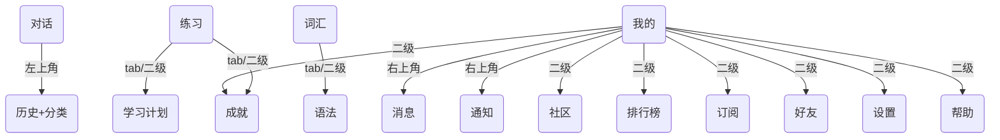

# SmallTalk App 底部导航与页面归属规划

## 1. 底部导航（Bottom Navigation）主入口

| 图标/名称      | 入口页面         | 说明/包含内容                                                                 |
|----------------|------------------|------------------------------------------------------------------------------|
| 对话 Dialogue  | Dialogue         | 主对话页，左上角有 History 图标，点击跳转到 History（历史+分类）              |
| 练习 Practice  | Practice         | 融合 Practice Exercises、Learning Plan，练习闯关、学习计划、进度等            |
| 词汇 Vocabulary| Vocabulary       | 词汇本、短语本，内含 Grammar（语法）                                         |
| 我的 My        | Profile          | 个人中心，包含 Community、Leaderboard、Achievements、Subscription、Friends 等  |

---

## 2. 详细页面归属与跳转建议

### 对话 Dialogue
- 主功能：AI对话
- 左上角：History（历史页，含分类/搜索/筛选）
- 右上角：可预留设置/帮助等入口（可选）

### 练习 Practice
- 主功能：练习闯关、学习计划
- 包含页面：Practice Exercises.html、Learning Plan.html、Achievements.html（成就可在此或"我的"展示）

### 词汇 Vocabulary
- 主功能：词汇本、短语本
- 包含页面：Vocabulary-Phrases.html、Phrasebook.html、Grammar Tips.html（语法作为tab或二级入口）

### 我的 My
- 主功能：个人中心
- 右上角：消息（Messages）、通知（Notifications）
- 包含页面：
  - Profile（个人信息）
  - Community（社区/动态）
  - Leaderboard（排行榜）
  - Achievements（成就/勋章）
  - Subscription（订阅/会员）
  - Friends（好友/好友列表/好友资料）
  - Settings（设置，作为"我的"里的一个功能项）
  - Help/Report a Problem（帮助/反馈，作为"我的"里的功能项）

---

## 3. 页面跳转与层级建议

- **对话页**左上角：History（历史+分类/搜索/筛选）
- **我的**右上角：消息、通知
- **我的**页面内：社区、排行榜、成就、订阅、好友、设置、帮助等二级入口
- **词汇**页面内：词汇、短语、语法tab切换或二级入口
- **练习**页面内：闯关、学习计划、成就tab切换或二级入口

---

## 4. 结构草图（Mermaid）

---

## 5. 设计建议
- 底部导航最多4个主入口，保证简洁。
- "设置"、"帮助"、"好友"等都放在"我的"页面内，避免底部导航过多。
- "历史"作为对话页的快捷入口，提升常用功能的可达性。
- "消息"、"通知"放在"我的"右上角，符合主流App习惯。 